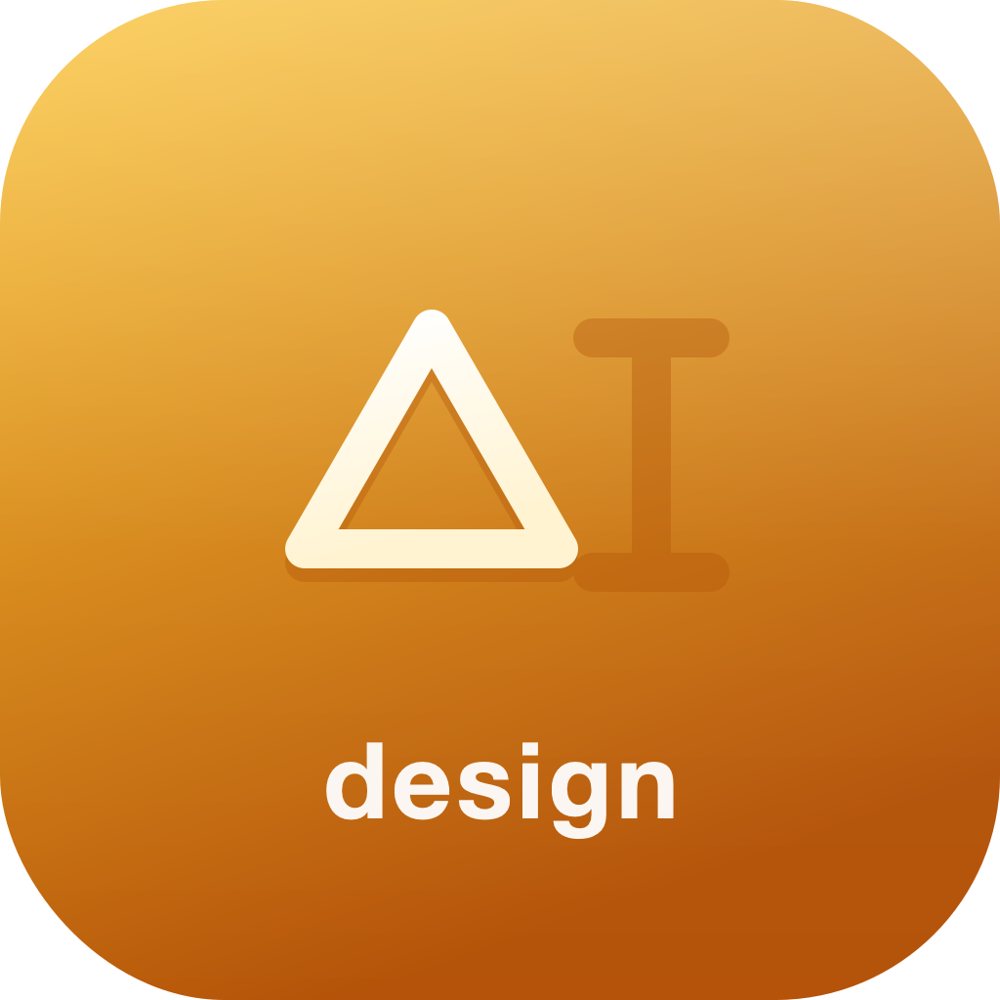
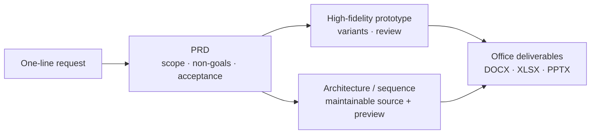

<div align="center">



# SOIA Open Dev Design Skills

**From a one-line request to a reviewable document and a clickable prototype**

6 skills covering PRDs, high-fidelity prototypes, architecture diagrams, and safe edits to Office files

[中文](README.md) · English · [Ecosystem portal](https://github.com/soia-team/soia-open-skills)

</div>

---

## What it solves

A request often arrives as one line, while everyone downstream needs **something they can build from** — scope, acceptance criteria, a prototype, an architecture diagram. The missing piece is the stretch that takes one line to something deliverable.



## 6 skills

### 01 Requirements and prototypes　`One line → PRD, user stories, a clickable prototype`

| Skill | Responsibility | Ready |
|---|---|:-:|
| `soia-dev-design-draft-prd` | Drafts PRDs, requirement docs and user stories; fills in scope and acceptance criteria | ✅ |
| `soia-dev-design-explorer` | High-fidelity HTML prototypes, design variants, decks and design review on Open Design | 🟡 |
| `soia-dev-open-design-ops` | Atomic Open Design operations and runtime guarantees for the layers above | 🟡 |

### 02 Diagrams　`Architecture and process notes → maintainable diagram source + preview`

| Skill | Responsibility | Ready |
|---|---|:-:|
| `soia-dev-archify-diagrams` | Generates maintainable JSON diagrams and PNG previews via Archify (architecture, data flow, sequence) | 🟡 |
| `soia-dev-drawio-visio-diagrams` | Safely converts, inventories and upgrades Visio VSDX into editable draw.io | ✅ |

### 03 Office files　`Existing documents → copied, modified, format-verified`

| Skill | Responsibility | Ready |
|---|---|:-:|
| `soia-dev-officecli-ops` | Reads, copies-then-modifies and verifies DOCX, XLSX and PPTX via OfficeCLI | 🟡 |

✅ Works right after install　🟡 Needs the corresponding tool or an API key first; the skill tells you what is missing before it runs

## Install

Any of three hosts. Installing the domain plugin brings all 6 skills at once.

```bash
claude plugin marketplace add soia-team/soia-open-skills && claude plugin install soia-dev-design@soia
```

```bash
codex plugin marketplace add soia-team/soia-open-skills && codex plugin add soia-dev-design@soia
```

WorkBuddy is a desktop app with no CLI, so a skill does the work — tell your agent "install into WorkBuddy", or run:

```bash
python3 <soia-open-skills>/skills/soia-meta-skill-release/scripts/install_workbuddy_experts.py soia-dev-design
```

Restart the client, then summon **Soia · 产品设计与文档** under Experts → My Experts.

> **Always-on cost ~548 tok**. `claude plugin disable soia-dev-design@soia` drops it to zero; enable it again any time.
> For a single skill use npx: `npx skills add soia-team/soia-open-dev-design-skills -g -a '*' -s <skill-name> -y` — pick one route or the other; running both puts the same skill in the index twice and the copies drift apart.

## What it does not do

- **Does not make product decisions.** Trade-offs and priorities are yours to call; the skills lay out the options and their costs.
- **Does not invent context.** When information is missing it asks, rather than filling the gap with industry boilerplate.
- **Does not invent your visual system.** Designs that need brand input ask for the assets first.
- **Never edits an Office file in place.** Always copy first, then modify, then run OpenXML validation.
- **Does not install environments.** Open Design, draw.io and similar prerequisites belong to [soia-open-env-skills](https://github.com/soia-team/soia-open-env-skills).

## Contributing

Before committing a skill change:

```bash
python3 -m unittest discover -s tests -p 'test_*.py' && python3 scripts/audit_skills.py --strict && python3 scripts/generate_expert_manifest.py --check
```

Full workflow in the portal's [CONTRIBUTING.md](https://github.com/soia-team/soia-open-skills/blob/main/CONTRIBUTING.md).

## License

MIT — see [LICENSE](./LICENSE).
