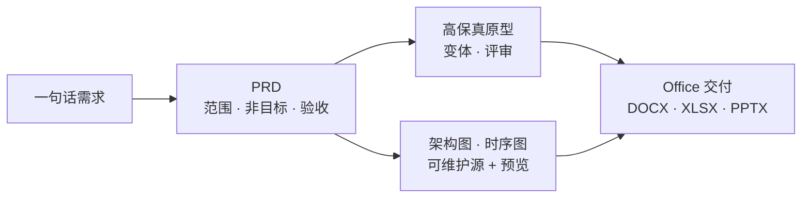

<div align="center">


# SOIA Open Dev Design Skills

**从一句话需求，到能评审的文档和能点的原型**

6 个技能覆盖 PRD、高保真原型、架构图与 Office 文件的安全改写

[English](README.en.md) · 中文 · [全生态门户](https://github.com/soia-team/soia-open-skills)

</div>

---

## 它解决什么

需求常常只有一句话，而下游要的是**别人能照着做的东西**——范围、验收标准、原型、架构图。缺的是把一句话补全到可交付的那段路。



## 6 个技能

### 01 需求与原型　`一句话需求 → PRD、用户故事与可点原型`

| 技能 | 职责 | 开箱 |
|---|---|:-:|
| [`soia-dev-design-draft-prd`](https://github.com/soia-team/soia-open-skills/blob/main/docs/skills/soia-dev-design-draft-prd.md) | 起草 PRD、产品需求文档与用户故事；补全范围与验收标准 | ✅ |
| [`soia-dev-design-explorer`](https://github.com/soia-team/soia-open-skills/blob/main/docs/skills/soia-dev-design-explorer.md) | 基于 Open Design 做高保真 HTML 原型、设计变体、幻灯片与设计评审 | 🟡 |
| [`soia-dev-open-design-ops`](https://github.com/soia-team/soia-open-skills/blob/main/docs/skills/soia-dev-open-design-ops.md) | 供上层设计流程调用的 Open Design 原子操作与运行保障 | 🟡 |

### 02 图表　`架构与流程说明 → 可维护的图表源 + 预览`

| 技能 | 职责 | 开箱 |
|---|---|:-:|
| [`soia-dev-archify-diagrams`](https://github.com/soia-team/soia-open-skills/blob/main/docs/skills/soia-dev-archify-diagrams.md) | 用 Archify 生成可维护 JSON 图表与 PNG 预览（架构、数据流、时序） | 🟡 |
| [`soia-dev-drawio-visio-diagrams`](https://github.com/soia-team/soia-open-skills/blob/main/docs/skills/soia-dev-drawio-visio-diagrams.md) | 把 Visio VSDX 安全转换、盘点并受控升级为可编辑 draw.io | ✅ |

### 03 Office 文件　`既有文档 → 复制后修改并通过格式校验`

| 技能 | 职责 | 开箱 |
|---|---|:-:|
| [`soia-dev-officecli-ops`](https://github.com/soia-team/soia-open-skills/blob/main/docs/skills/soia-dev-officecli-ops.md) | 用 OfficeCLI 安全读取、复制后修改并验证 DOCX、XLSX、PPTX | 🟡 |

✅ 装完即用　🟡 需先装对应工具或申请 API key，技能会在执行前告诉你缺什么

## 安装

三个宿主任选，装整个领域插件即 6 个技能一次到位。

```bash
claude plugin marketplace add soia-team/soia-open-skills && claude plugin install soia-dev-design@soia
```

```bash
codex plugin marketplace add soia-team/soia-open-skills && codex plugin add soia-dev-design@soia
```

WorkBuddy 是桌面端没有 CLI，由技能代劳——对 AI 说「装到 WorkBuddy」，或直接跑：

```bash
python3 <soia-open-skills>/skills/soia-meta-skill-release/scripts/install_workbuddy_experts.py soia-dev-design
```

装完重启客户端，在【专家中心 → 我的专家】召唤 **Soia · 产品设计与文档**。

> **常驻成本 ~548 tok**。不用时 `claude plugin disable soia-dev-design@soia` 降到零，随时开回来。
> 只想要单个技能可走 npx：`npx skills add soia-team/soia-open-dev-design-skills -g -a '*' -s <技能名> -y`——与插件二选一，并存会产生双份索引且各自漂移。

## 不负责什么

- **不替你定产品决策**。范围取舍与优先级由人拍板，技能负责把选项和代价讲清楚。
- **不编造需求背景**。信息不足就问，不用行业套话填空。
- **不自行发明视觉规范**。需要品牌输入的设计先要素材。
- **不在原件上改 Office 文件**。一律复制后修改，改完做 OpenXML 校验。
- **不做环境安装**。Open Design、draw.io 等依赖交给 [soia-open-env-skills](https://github.com/soia-team/soia-open-env-skills)。

## 贡献

改动技能后提交前跑：

```bash
python3 -m unittest discover -s tests -p 'test_*.py' && python3 scripts/audit_skills.py --strict && python3 scripts/generate_expert_manifest.py --check
```

完整流程见门户仓 [CONTRIBUTING.md](https://github.com/soia-team/soia-open-skills/blob/main/CONTRIBUTING.md)。

## License

MIT —— 见 [LICENSE](./LICENSE)。
